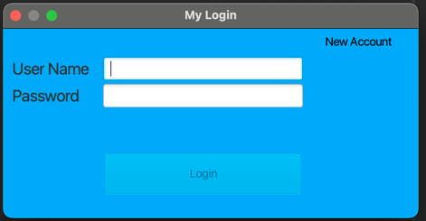
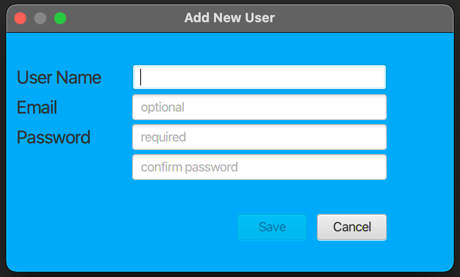
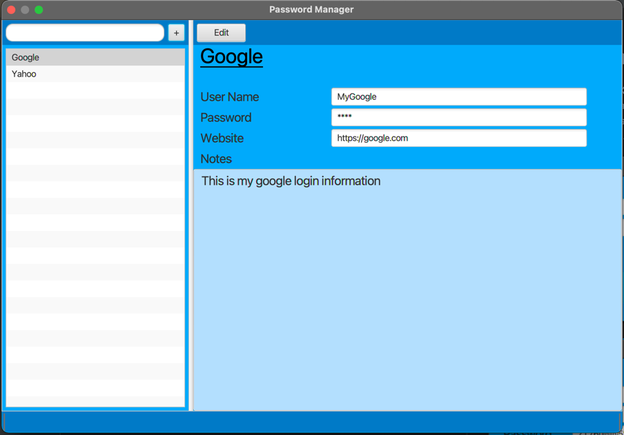
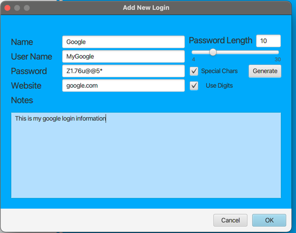
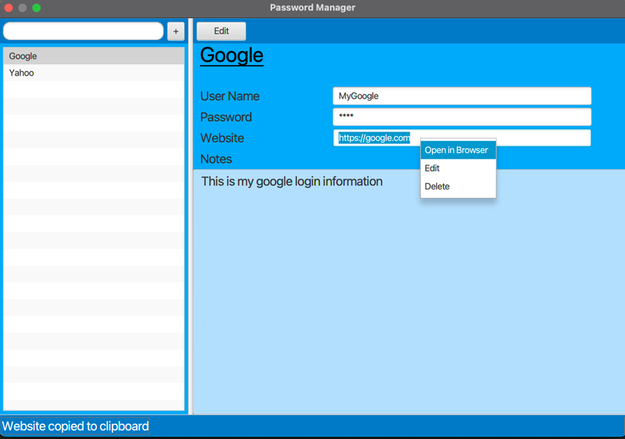

# Password Manager
**Password Manager** is a JavaFX application that allows secure/encrypted storage of usernames, passwords, notes and URLs. 
Program user can create an account and securely store login items. 
 
New account can be created using the "**New Account**" link on the top of the page.
 

To add a new user to the database, fill out the required fields

Items will be sorted alphabetically on the left side of the application and can be filtered using the search box.

To add a new login item click the "+" button on the right side of the search box.

Generate button allows an easy random password generation.

 

To open the URL in the default browser right-click on the website field and select "Open in Browser" menu item.

